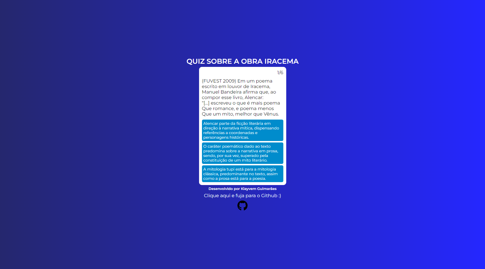

<h1 align="center"> Quiz sobre a Obra de José de Alencar "Iracema" </h1>

Projeto desenvolvido para um trabalho de Português  

 

  

## 🚀 Tecnologias

Esse projeto foi desenvolvido com as seguintes tecnologias:

- HTML e CSS
- JavaScript
- Git e Github

## 💻 Projeto

Esse projeto foi feito para abstrar de forma visual questôes de vestibular sobre o tema "Iracema", uma obra de José de Alencar.

[Clique aqui para acessar!](https://klayvemguimaraes.github.io/Quiz-Iracema/index.html)
